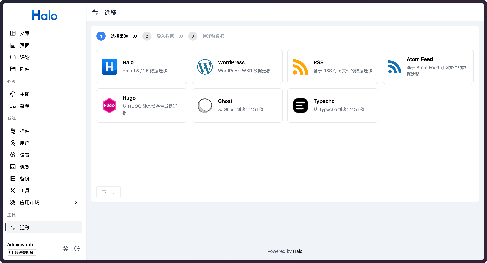

# plugin-migrate

支持从其他平台迁移数据到 Halo 的插件。



目前已支持以下平台：

1. Halo 1.5 / 1.6
2. [WordPress](https://wordpress.org/)
3. RSS / Atom 订阅链接
4. [Hugo](https://gohugo.io/)
5. [Ghost](https://ghost.org/)
6. [Typecho](https://github.com/typecho/typecho)

## 使用方式

1. 下载，目前提供以下两个下载方式：
    - GitHub Releases：访问 [Releases](https://github.com/halo-sigs/plugin-migrate/releases) 下载 Assets 中的 JAR 文件。
    - Halo 应用市场：<https://halo.run/store/apps/app-TlUBt>
2. 安装，插件安装和更新方式可参考：<https://docs.halo.run/user-guide/plugins>
3. 启动插件之后，即可在 Console 的左侧菜单栏看到 **迁移** 的菜单。

> **Warning**
> 详细的迁移文档请查阅 <https://halo-plugin-migrate.pages.dev>

## 开发环境

插件开发的详细文档请查阅：<https://docs.halo.run/developer-guide/plugin/introduction>

所需环境：

1. Java 17
2. Node 20
3. pnpm 10
4. Docker (可选)

克隆项目：

```bash
git clone git@github.com:halo-sigs/plugin-migrate.git

# 或者当你 fork 之后

git clone git@github.com:{your_github_id}/plugin-migrate.git
```

```bash
cd path/to/plugin-migrate
```

### 运行方式 1（推荐）

> 此方式需要本地安装 Docker

```bash
# macOS / Linux
./gradlew pnpmInstall

# Windows
./gradlew.bat pnpmInstall
```

```bash
# macOS / Linux
./gradlew haloServer

# Windows
./gradlew.bat haloServer
```

执行此命令后，会自动创建一个 Halo 的 Docker 容器并加载当前的插件，更多文档可查阅：<https://docs.halo.run/developer-guide/plugin/basics/devtools>

### 运行方式 2

> 此方式需要使用源码运行 Halo

编译插件：

```bash
# macOS / Linux
./gradlew build

# Windows
./gradlew.bat build
```

修改 Halo 配置文件：

```yaml
halo:
  plugin:
    runtime-mode: development
    fixedPluginPath:
      - "/path/to/plugin-migrate"
```

最后重启 Halo 项目即可。
