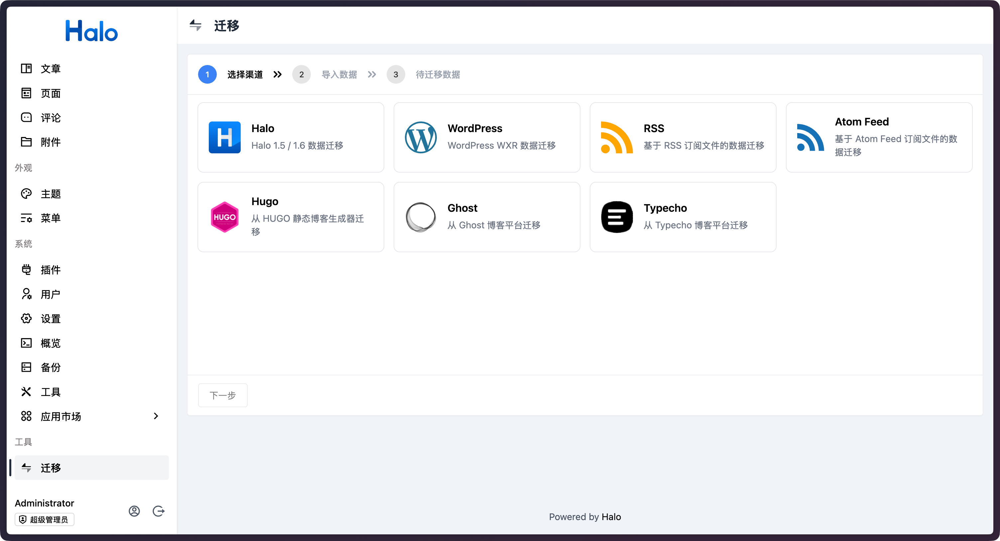

# plugin-migrate

支持从其他平台迁移数据到 Halo 的插件。



目前已支持以下平台：

1. Halo 1.5 / 1.6
2. WordPress
3. Ghost
4. Typecho
5. RSS / Atom 订阅文件或订阅链接
6. Markdown（适用于 Markdown + Front Matter 静态博客内容导入）

## 功能概览

1. 每个 Provider 拥有独立的导入 UI 和数据转换逻辑，最终统一汇总为 Halo 导入任务。
2. 大多数平台支持统一的附件处理流程：本地上传或手动迁移；Markdown 仅支持本地目录上传；RSS / Atom 会保留原始远程资源链接。
3. 对包含邮箱的来源用户，导入时会优先匹配现有 Halo 用户；若不存在，则自动创建 `guest` 用户，并尽量保留文章、页面、评论的归属关系。
4. Markdown 导入支持 YAML / TOML / JSON Front Matter，支持常见标题、摘要、分类、标签、发布时间、页面类型以及 `cover` / `thumbnail` / `feature_image` 等封面字段。

## 使用方式

1. 下载，目前提供以下两个下载方式：
    - GitHub Releases：访问 [Releases](https://github.com/halo-sigs/plugin-migrate/releases) 下载 Assets 中的 JAR 文件。
    - Halo 应用市场：<https://halo.run/store/apps/app-TlUBt>
2. 安装，插件安装和更新方式可参考：<https://docs.halo.run/user-guide/plugins>
3. 启动插件之后，即可在 Console 的左侧菜单栏看到 **迁移** 的菜单。

> **Warning**
> 详细的迁移文档请查阅 <https://halo-plugin-migrate.pages.dev>

> **Tip**
> 建议先在本地环境测试导入，确认无误后再考虑在生产环境执行。这样做的原因是：
> 1. 导入失败的因素较多，在本地更容易快速重试并定位原因。
> 2. 导入过程会频繁请求后端并上传附件，在线上环境可能因为服务器性能或网络波动导致导入变慢，甚至出现部分数据导入失败。
> 3. 本地验证通过后，可以利用 Halo 自身的备份恢复能力，更快地在生产环境完成数据恢复或回滚。

## 开发环境

插件开发的详细文档请查阅：<https://docs.halo.run/developer-guide/plugin/introduction>

所需环境：

1. Java 21
2. Node 24
3. pnpm 10
4. Docker (可选)

克隆项目：

```bash
git clone git@github.com:halo-sigs/plugin-migrate.git

# 或者当你 fork 之后

git clone git@github.com:{your_github_id}/plugin-migrate.git
```

```bash
cd path/to/plugin-migrate
```

### 运行方式（推荐）

> 此方式需要本地安装 Docker

```bash
# macOS / Linux
./gradlew pnpmInstall

# Windows
./gradlew.bat pnpmInstall
```

```bash
# macOS / Linux
./gradlew haloServer

# Windows
./gradlew.bat haloServer
```

执行此命令后，会自动创建一个 Halo 的 Docker 容器并加载当前的插件，更多文档可查阅：<https://docs.halo.run/developer-guide/plugin/basics/devtools>
