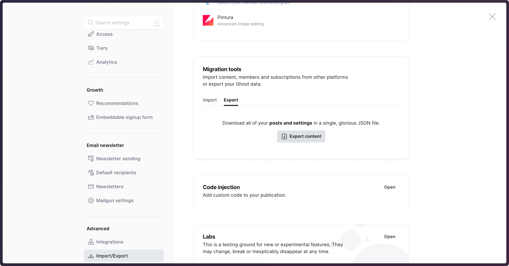
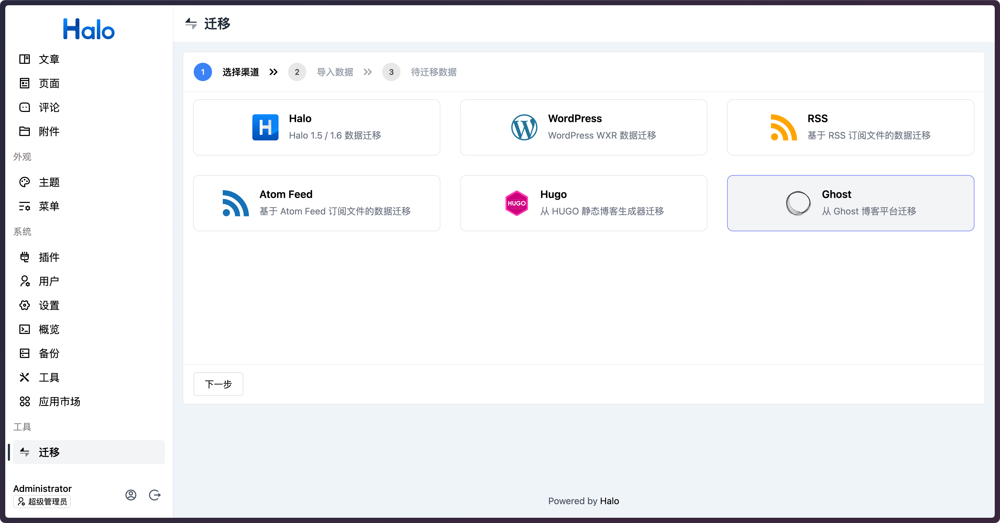
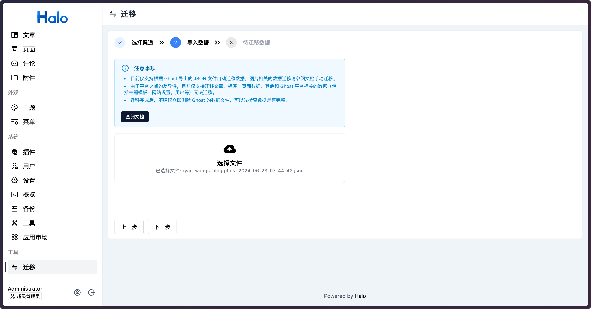
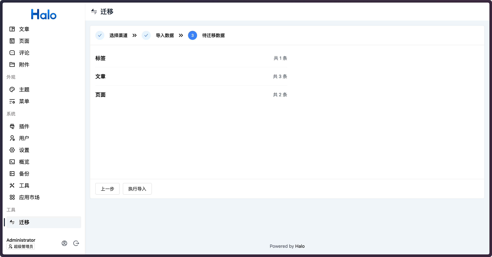

# Ghost 数据迁移

此插件提供了从 Ghost 迁移数据到 Halo 的功能，支持从 Ghost 导入的 JSON 文件解析数据并转换为 Halo 的数据格式。

注意事项：

- 目前仅支持根据 Ghost 导出的 JSON 文件自动迁移数据，图片相关的数据迁移请参阅下面的文档手动迁移。
- 由于平台之间的差异性，目前仅支持迁移**文章**、**标签**、**页面**数据，其他和 Ghost 平台相关的数据（包括主题模板、网站设置，用户等）无法迁移。
- 迁移完成后，不建议立即删除 Ghost 的数据文件，可以先检查数据是否完整。

## 导出 Ghost 数据

进入 Ghost 的设置页面，找到 `Import/Export` 选项，然后点击 `Export content` 按钮即可导入 Ghost 的数据为 JSON 文件。

{data-zoomable}

## 图片迁移

Ghost 平台目前没有将上传的图片信息持久化到数据库，所以目前只能手动复制 Ghost 平台的图片到 Halo 的附件目录下，并设置映射规则，让图片可以在 Halo 正常访问。

1. 进入 Ghost 所在的服务器，找到 Ghost 的附件存储目录，例如 `/ghost_path/content/images`，将该目录下的所有文件复制到 Halo 工作目录下的 `attachments/migrate-from-ghost` 目录中。
2. 最终在 Halo 的附件目录下会得到如下所示的目录结构：

   ```shell
    {halo-work-dir}/attachments
    ├── migrate-from-ghost
    │   ├── 2021
    │   ├── 2022
    └── upload
        └── local
   ```

3. 配置映射规则，将 Ghost 平台的图片路径映射到 Halo 的附件目录中。在 Halo 的 Docker 容器添加以下启动参数：

   ```shell
   - --halo.attachment.resource-mappings[0].pathPattern=/content/images/**
   - --halo.attachment.resource-mappings[0].locations[0]=migrate-from-ghost
   ```

   如果你的 Halo 是通过配置文件配置的，也可以在配置文件中添加以下配置：

   ```yaml
   halo:
     attachment:
       resource-mappings:
         - pathPattern: /content/images/**
           locations:
             - migrate-from-ghost
   ```

## 迁移数据

进入迁移页面，选择 Ghost。

{data-zoomable}

然后选择从 Ghost 平台导出的 JSON 文件。

{data-zoomable}

点击**执行导入**按钮即可开始迁移数据。

{data-zoomable}
