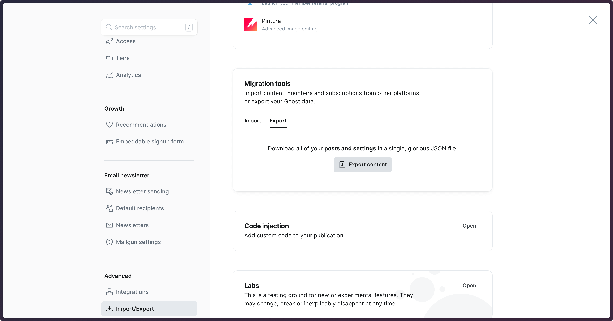

# Ghost 数据迁移指引

## 介绍

本指引提供了从 `Ghost` 迁移至 `Halo 2.x` 的方案。

## 注意事项

1. 目前通过 Ghost 后台导出的 JSON 文件进行迁移。
2. 当前开发与回归测试主要基于仓库中的 Ghost `6.28.0` 导出样例。
3. 当前主要支持迁移 **文章**、**页面**、**标签**。主题、站点设置等 Ghost 特有能力不会迁移。
4. Ghost 导出的 JSON 不包含独立附件表，系统会从文章、页面和标签封面中的本地媒体链接自动识别附件。
5. 如果 Ghost 导出中包含作者邮箱，导入时会优先按邮箱匹配现有 Halo 用户；未匹配到时会自动创建 `guest` 用户，以尽量保留内容归属。

## 准备工作

1. 进入 Ghost 后台的 `Settings -> Labs`，点击 `Export your content`，下载导出的 JSON 文件。

   {data-zoomable}

   <!-- TODO: 补图（Ghost）- 后台 Labs 页面，突出导出内容入口 -->
2. 如果站点中使用了本地图片或文件，建议同时从服务器备份 Ghost 的 `content` 目录，至少保留 `content/images` 和 `content/files` 作为附件迁移备用。
   <!-- TODO: 补图（Ghost）- 服务器中的 content/images 与 content/files 目录示意 -->
3. 如果计划在迁移后继续保留 Ghost 原始媒体路径，可提前在 Halo 侧准备资源映射：

   ```yaml
   halo:
     attachment:
       resource-mappings:
          - pathPattern: /content/images/**
            locations:
              - migrate-from-ghost
          - pathPattern: /content/files/**
            locations:
              - migrate-from-ghost
   ```
4. 建议先在本地环境完成一轮完整导入测试，再考虑在生产环境执行。这样更方便快速重试和定位问题，也能避免线上因频繁请求后端、上传附件而出现导入变慢或部分失败；本地验证通过后，还可以结合 Halo 的备份恢复能力更快完成线上恢复或回滚。

## 执行迁移

1. 点击左侧菜单的迁移进入迁移页面。
2. 在选择渠道步骤中，选择 **Ghost**，点击下一步。
   <!-- TODO: 补图（Ghost）- 迁移首页选择 Ghost Provider -->
3. 选择从 Ghost 后台导出的 JSON 文件。
   <!-- TODO: 补图（Ghost）- 上传 Ghost JSON 文件的界面 -->
4. 等待系统解析文章、页面、标签、作者归属及本地媒体引用。
5. 如果检测到本地媒体资源：
   - 选择 **上传到 Halo** 时，可选择 Ghost 的 `content` 目录、`content/images` / `content/files` 子目录，或包含这些目录的任意上级目录。
   - 选择 **手动迁移** 时，需要自行将备份的 `content` 目录迁移到 Halo 附件目录，并确保资源映射已配置完成。
   <!-- TODO: 补图（Ghost）- 附件处理步骤，展示本地媒体目录选择 -->
6. 确认数据概览无误后，进入下一步并开始迁移。
   <!-- TODO: 补图（Ghost）- 数据概览或任务确认页面 -->
7. 迁移完成后，建议优先抽样检查文章封面、正文图片和标签封面是否都已正确解析。
