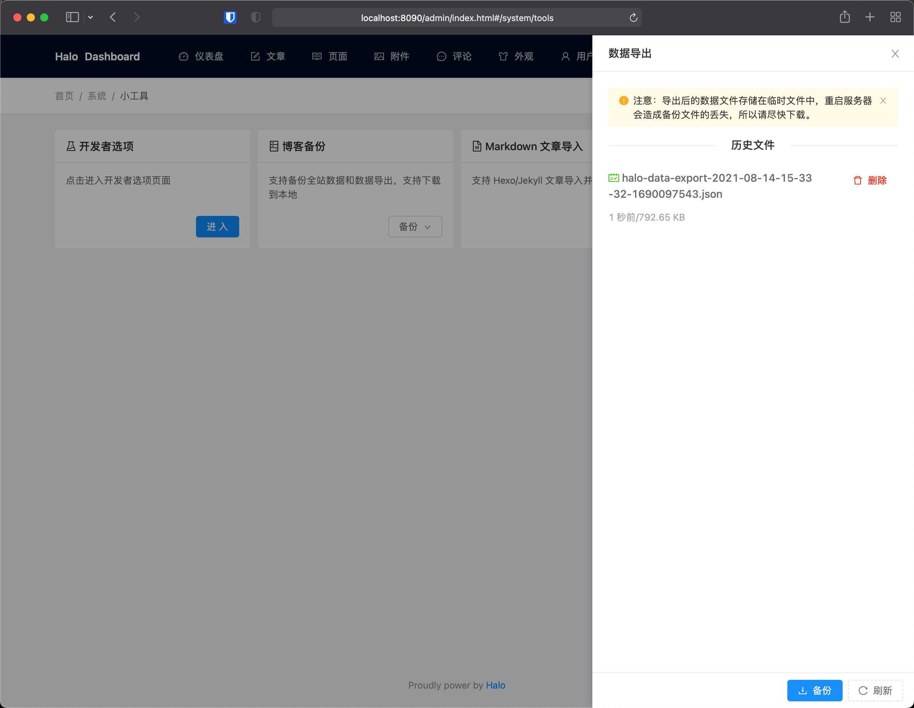
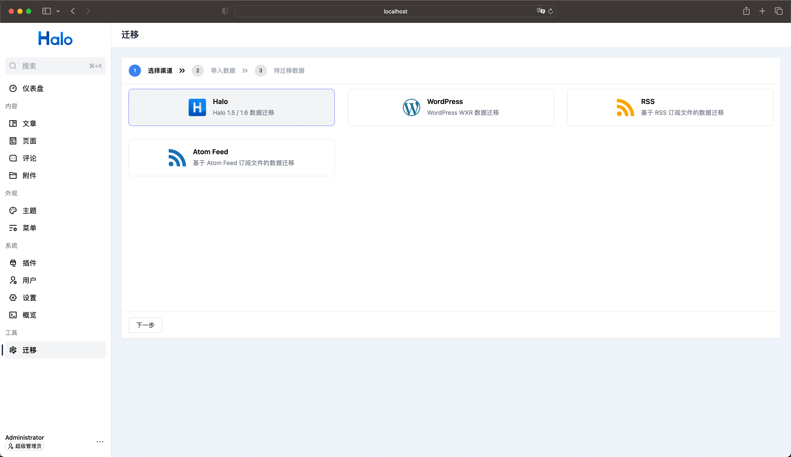

# Halo 1.x 数据迁移指引

## 介绍

本指引提供了从 `Halo 1.5 / 1.6` 迁移至 `Halo 2.x` 的方案。

## 注意事项

由于 Halo 2.0 的底层架构变动，无法兼容 1.x 的数据，导致无法平滑升级，所以需要进行数据迁移。为此，我们提供了从 Halo 1.5 / 1.6 版本迁移的方案。在进行迁移之前，**有几点注意事项和要求，如果你目前无法满足，建议先暂缓迁移。**

- Halo 版本必须为 1.5.x 或 1.6.x。如果不满足，需要先升级到 1.5.x 或 1.6.x 版本。
- Halo 2.0 不兼容 1.x 的主题，建议在升级前先查询你正在使用的主题是否已经支持 2.0。你可以访问 [halo-sigs/awesome-halo](https://github.com/halo-sigs/awesome-halo) 或 [应用市场](https://halo.run/store/apps?type=THEME) 查阅目前支持的主题。
- Halo 2.0 目前没有内置 Markdown 编辑器，如果需要重新编辑迁移后的文章，需要额外安装 Markdown 编辑器插件。目前社区已经提供了以下插件：
  - StackEdit：<https://halo.run/store/apps/app-hDXMG>
  - ByteMD：<https://halo.run/store/apps/app-HTyhC>
- Halo 2.0 不再内置友情链接、日志、图库等模块，需要安装额外的插件，目前官方已提供：
  - 链接管理：<https://halo.run/store/apps/app-hfbQg>
  - 图库：<https://halo.run/store/apps/app-BmQJW>
  - 瞬间（原日志）：<https://halo.run/store/apps/app-SnwWD>
- Halo 2.0 不再内置外部云存储的支持。需要安装额外的插件，目前官方已提供：
  - S3（兼容国内主流的云存储）：<https://halo.run/store/apps/app-Qxhpp>
  - 阿里云 OSS：<https://halo.run/store/apps/app-wCJCD>
- 对于可识别且带有邮箱的来源用户，插件会在导入时优先匹配现有 Halo 用户；未匹配到时会自动创建 `guest` 用户，并尽量保留文章、页面、评论的归属关系。无法匹配的记录会回退为当前执行导入的用户。
- 为了防止直接升级 2.0 导致 1.x 的数据受到破坏，我们已经将工作目录由 `~/.halo` 变更为 `~/.halo2`。

## 准备工作

1. 在进行迁移操作之前，强烈建议先**完整备份所有数据**。
2. 在 Halo 1.5.x / 1.6.x 后台导出最新的数据文件，后续插件会基于该 JSON 文件执行导入。

   <!-- TODO: 补图（Halo 1.x）- 后台导出数据文件页面 -->
   {data-zoomable}

3. 建议同时从旧站点服务器备份附件目录与相关云存储配置：
   - 本地附件：备份 Halo 1.x 工作目录中的 `upload` 目录。
   - 云存储附件：确认原存储桶、对象 Key 和访问配置仍可用。
4. 提前安装迁移过程中可能需要的 Halo 插件：
   - 链接管理：<https://halo.run/store/apps/app-hfbQg>
   - 图库：<https://halo.run/store/apps/app-BmQJW>
   - 瞬间（原日志）：<https://halo.run/store/apps/app-SnwWD>
   - S3（如果需要迁移云存储附件）：<https://halo.run/store/apps/app-Qxhpp>
5. 如果 Halo 1.x 中使用了云存储，建议先在 Halo 2.x 中创建对应的存储策略。
6. 建议先在本地环境完成一轮完整导入测试，再考虑在生产环境执行。这样更方便快速重试和定位问题，也能避免线上因频繁请求后端、上传附件而出现导入变慢或部分失败；本地验证通过后，还可以结合 Halo 的备份恢复能力更快完成线上恢复或回滚。

## 执行迁移

1. 点击左侧菜单的迁移进入迁移页面。
2. 在选择渠道步骤中，选择 **Halo 1.x**，点击下一步。

   <!-- TODO: 补图（Halo 1.x）- 迁移首页选择 Halo 1.x Provider -->
   {data-zoomable}

3. 在导入数据步骤中，点击 **选择文件** 按钮，选择在 Halo 1.5.x / 1.6.x 导出的数据文件（JSON 格式），之后点击下一步。
   <!-- TODO: 补图（Halo 1.x）- 选择 Halo 1.x 导出 JSON 文件 -->
4. 如果存在需要迁移的附件，则会出现附件处理步骤：
   - 对本地附件，可选择 **上传到 Halo** 或 **手动迁移**。
   - 对云存储附件，可选择之前创建的存储策略。
   完成之后点击下一步。
   <!-- TODO: 补图（Halo 1.x）- 附件处理步骤，展示本地附件与云存储策略选择 -->
5. 在待迁移数据步骤中，可以再次审查待迁移的数据，确认无误后点击 **执行导入**。
   <!-- TODO: 补图（Halo 1.x）- 待迁移数据概览或任务确认页面 -->
6. 迁移完成后，建议优先检查文章所有者、评论归属、附件链接以及依赖插件的数据类型是否都已正确迁移。
